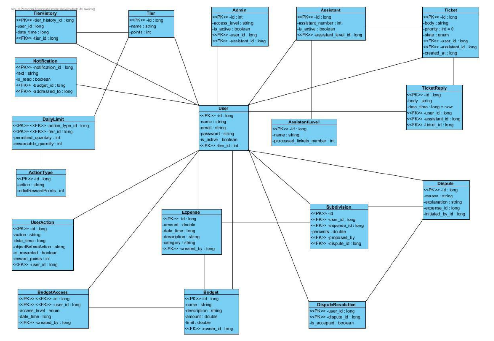

# Divi - Personal Finance Manager

## Description

Divi is a standalone desktop application for managing personal and shared finances. It was developed to address a common problem: individuals, families, and small teams often struggle to keep track of budgets, shared expenses, and financial responsibilities in a clear and organized way — especially without depending on cloud-based services.

Unlike most budgeting tools that require online accounts or subscriptions, Divi operates entirely locally, using Java + MySQL. This ensures privacy, full control of data, and offline availability.

During development, we gained experience in requirements engineering, database modeling, user authentication with security constraints, modular Java architecture, and GUI design using Swing.

## Table of Contents

- [Installation](#installation)
- [Usage](#usage)
- [Features](#features)
- [Tech Stack](#tech-stack)
- [Architecture](#architecture)
- [Credits](#credits)
- [License](#license)
- [How to Contribute](#how-to-contribute)
- [Tests](#tests)

## Installation

1. Clone the repository to your local machine.
2. Install Java Runtime Environment (JRE 8 or higher).
3. Install MySQL Server locally.
4. Configure the application.properties file with database credentials.
5. Compile and run the Java application using your preferred IDE or command line.

## Usage

1. Launch the application.
2. Create a new user account or log in with existing credentials.

<div style="display: flex; gap: 10px;">
  
  
</div>

3. Create a new budget and invite participants if needed.


4. Start adding expenses, categorizing them, and managing your finances.

<div style="display: flex; gap: 10px;">
  
  
</div>

5. Explore the various features like reports, charts, and ticketing for support.

## Features

- User authentication with optional email-based verification.
- Create and manage multiple budgets with multi-category tracking.
- Record, categorize, and import expenses (manually or via CSV/clipboard).
- Share budgets with different permission levels (viewer, editor, owner).
- Split expenses automatically or manually among participants.
- Track financial activity via tables, charts, and real-time statistics (for admin users).
- Export reports to PDF.
- Use an integrated ticket system for support or internal collaboration.

## Tech Stack:
- **Backend**: Java with Spring Boot
- **Database**: MySQL
- **Frontend**: Java Swing with FlatLaf for GUI, JFree for charts
- **Testing**: JUnit
- **Build Tool**: Maven

## Architecture

### Use Case Diagrams

<div style="display: flex; gap: 10px;">
  
  
</div>
<div style="display: flex; gap: 10px;">
  
  
</div>

### Class Diagram

The class diagrams illustrate the evolution of the system's design from the initial draft to the final implementation:

- **Initial Class Diagram**: The initial design focused on establishing the core structure and relationships between components.


- **Final Class Diagram**: The final design represents a more detailed and optimized architecture, incorporating additional features and improvements.


### Database Schema

The database schema underwent significant improvements during the development process. Below are the visual representations of the initial and final versions:

- **Initial Schema**: The initial design was a preliminary draft, focusing on basic functionality and structure.



- **Final Schema**: The final design reflects a more refined and optimized structure, incorporating feedback and addressing limitations from the initial version.


## Credits

This project was developed by a team of students as part of an academic module:

- [Anton Riabokon](https://github.com/Trio0o)
- [Gabriel Gustavo Ramos de Oliveira](https://github.com/Gabriel0liv)
- [Gonçalo Diogo Silva Martins](https://github.com/GoncaloSM1)
- [Gustavo Henrique Nogueira Gião](https://github.com/gustavogiao)
- [Ratmir Mukazhanov](https://github.com/ratmir-mukazhanov)

We would like to thank the following resources and libraries that helped us in the development of this project:
- [Spring Boot](https://spring.io/projects/spring-boot) - For the backend framework.
- [FormDev Software](https://www.formdev.com/flatlaf/) - For the FlatLaf library used for the GUI.
- [JFree](https://www.jfree.org/jfreechart/) - For creating charts and graphs.

## License

This project is licensed under the MIT License.

Consult the [`LICENSE`](licence.txt) file for more details.

## How to Contribute

This project was developed as part of an academic module. External contributions are not yet accepted formally. However, suggestions and feedback are welcome.

## Tests

Unit tests were written using JUnit and can be found in the `src/test/java` directory. To run the tests, use your IDE's built-in testing tools or run the following command if using Maven:

```bash
mvn test
```


